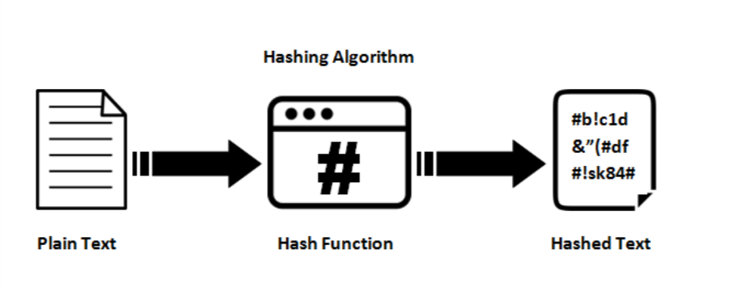

# BLOCKCHAIN

## **INTRODUCCION:**

Un Blockchain es una estructura que está entrelazada secuencialmente mediante bloques. Cada bloque tiene un enlace criptográfico con el bloque anterior, es decir que guarda la llave del bloque anterior. Esto garantiza la seguridad de los datos y evita la manipulación de la información almacenada en el Blockchain.

## **Descripción del caso de estudio planteado**
En el dominio de las transacciones, como los retiros de dinero, es importante tener en cuenta que la estructuras para poder utilizar sean confiables y así poder validar la integridad  de los registros. El Blockchain nos proporciona esta situación; al utilizar la estructura como una cadena de bloques nos da seguridad al momento de hacer el retiro. Por otro lado al
## **SHA256**
El SHA256 es un algoritmo criptográfico desarrollado por NSA( Agencia de Seguridad Nacional de los Estados Unidos ) y su principal objetivo es generar un hash único a partir de cualquier información entrante al bloque de Blockchain. SHA-256 es unidireccional, es decir que cualquier tipo de entrada de información al bloque nos da una salida de 256 bits(32 Bytes) y cualquier tipo de cambio mínimo en la información genera una hash completamente diferente.
##### *PROPIEDADES*
- Resistencia a colisiones: La improbabilidad de que 2 tipos de datos diferentes generen el 
    mismo hash.
- Determinístico: Dando los mismo datos genera el mismo hash.
- No invertible: A partir del mismo hash no se puede obtener la información de los bloques.
- Sensible a los cambios: Una modificación menor genera un hash completamente diferente.

  
## **DOMIMIO DE TRACSACCIONES**
Retiro de dinero(Cliente,Lugar,Monto,fecha)
## **ESTRUCTURA DE DATOS A UTILIZAR**
- VECTOR:Esta estructura la utilizamos para poder guardar el dato de cliente, lugar, monto y fecha, cuando hacemos un retiro. 
  
- TRIE:
-  
- HEAP: Usamos esta estructura para poder obtener  el máximo(maxheap) y el mínimo(minheap) de la fecha y el monto.
-  

## **RELACIÓN ENTRE CLASES**

La clase Block tiene una relación de composición con la clase Retiro, ya que contiene un vector de punteros a objetos Retiro (retiros).
La clase BlockChain tiene una relación de agregación con la clase Block, ya que mantiene una referencia al bloque inicial (head) y gestiona los bloques dentro de la cadena de bloques.
La clase Sistema tiene una relación de agregación con la clase Usuario, ya que mantiene una colección de usuarios (usuarios).
La clase Sistema tiene una relación de composición con la clase BlockChain, ya que contiene un puntero a la instancia de BlockChain (blockchain).

-  

## COMPLEJIDAD ALGORITMICA

 - BLOCKCHAIN:
## **REQUERIMIENTO**

- [MinGW](https://www.mingw-w64.org/downloads/)
- [SFML 2.5.1](https://www.sfml-dev.org/download/sfml/2.5.1/)
- [openssl](https://www.openssl.org/)

## **BIBLIOGRAFIA**
- Brownworth, A. (s/f). Blockchain Demo. Andersbrownworth.com. Recuperado el 10 de julio de 2023, de https://andersbrownworth.com/blockchain/
- Muganga, N. (2022, diciembre 21). Principales lenguajes de programación de cadena de bloques para un desarrollo seguro. Geekflare. https://geekflare.com/es/blockchain-programming-languages/
- OpenSSL Foundation, Inc. (s/f). /docs/man3.1/man3/SHA256.Html. Openssl.org. Recuperado el 10 de julio de 2023, de https://www.openssl.org/docs/man3.1/man3/SHA256.h
- openssl: TLS/SSL and crypto library. (s/f).
  

  ## Equipo:

|    Marcela Ezpinoza   |    Leandro Machaca    |    Alexandro Chambochumbi   |    Ibañes Perez   |
| ----------- | ----------- | ----------- | ----------- |
|  |  |  |  |
| [github.com/marcelaespinoza](https://github.com/marcelaespinoza) | [github.com/JLeandroJM](https://github.com/JLeandroJM) | [github.com/AlexandroChamochumbi](https://github.com/AlexandroChamochumbi) | [github.com/ibanes](https://github.com/ibanesss121232)|  
